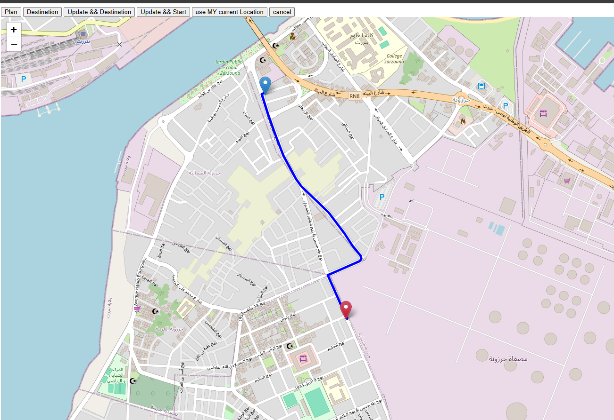

# Forsa
Forst is a Tunisia-focused ride-hailing application designed to provide safe, fast, and convenient transportation across cities and towns. Leveraging real-time geolocation and smart routing algorithms, Forst connects passengers with nearby drivers, ensuring a seamless and efficient travel experience

